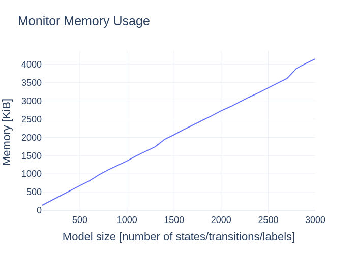
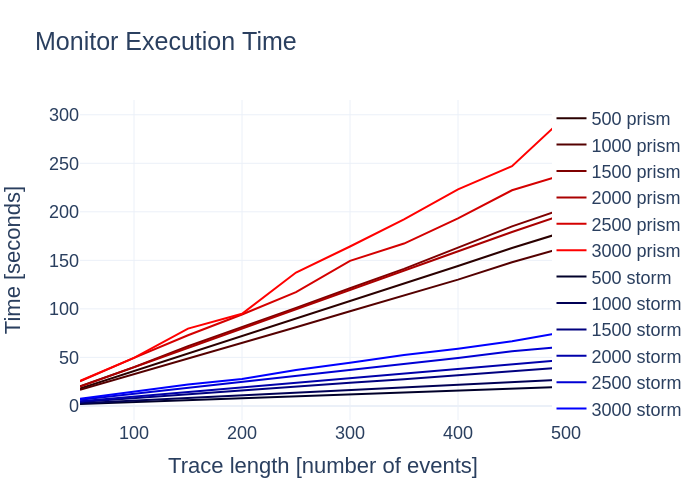
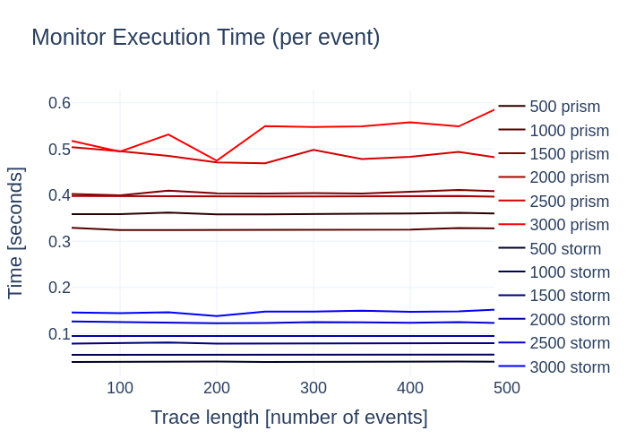
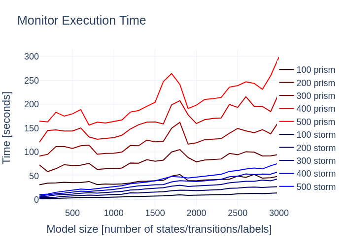
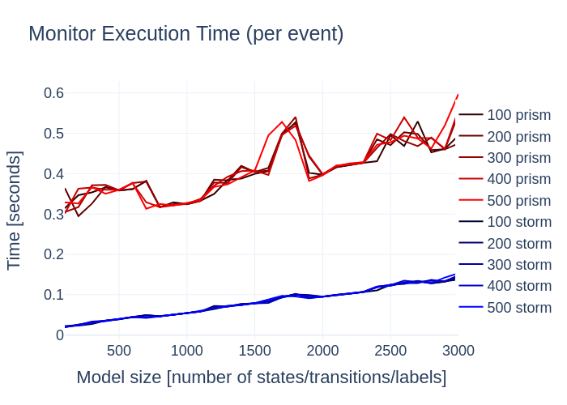

# Probabilistic Runtime Verification through Probabilistic Model Checking

This tool allows to perform Runtime Verification of PCTL properties w.r.t. a DTMC model specified in either PRISM or Bigraph format.

## To install
- Python 3 (https://www.python.org/)
- PRISM model checker (https://www.prismmodelchecker.org/)
- STORM model checker (https://www.stormchecker.org/)
- BIGRAPHER (https://www.dcs.gla.ac.uk/~michele/bigrapher.html)

All the previous tools need to be added to the PATH system variable (test it by typing on the command line: prism, storm, and bigrapher).

## To run

To run the application open the command line and paste the following line

```bash
python3 main.py <model> <property> <trace> --storm
```

where:
- model is the file containing the probabilistic model denoting the system to verify at runtime; this can be either a PRISM model (with extension .prism), or a BIGRAPHER model (with extension .big).
- property is the file containing the PCTL formula to verify at runtime (with extension .csl).
- trace is the file containing the trace of events to be analysed by the monitor.
- the --storm flag is optional (when it is passed, the probabilistic model checker used becomes STORM, instead of PRISM)

## To reproduce the experiments

To reproduce the experiments open the command line and paste the following line

```bash
python3 experiments.py <minSize> <maxSize> <stepSize> <minTrace> <maxTrace> <stepTrace> <numRepetitions>
```

where:
- minSize, maxSize and stepSize are parameters that guide the generation of randomly generated models of size S, with minSize <= S <= maxSize. For instance, if you pass 10 101 10, it will consider 10 models of size: 10, 20, 30, 40, 50, 60, 70, 80, 90, and 100 (one for each size is considered).
- minTrace, maxTrace and stepTrace are parameters that guide the generation of randomly generated traces of events of size T, with minTrace <= T <= maxTrace.
- numRepetitions denotes how many times each run has to be repeated; the computed time is the average of such runs. This parameter is used to reduce the impact of the noice introduced by the machine (e.g., other processes running on the machine that could slow down one specific execution).

The results of the experiments will be stored inside the experiments folder.
In the following, we report the plots resulting from running our tool on the synthetic experiments presented in paper.









